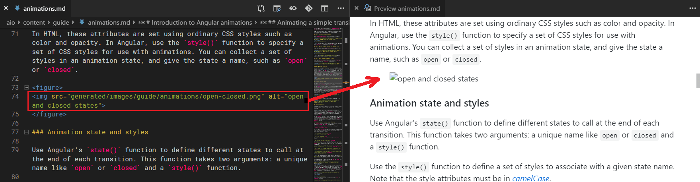
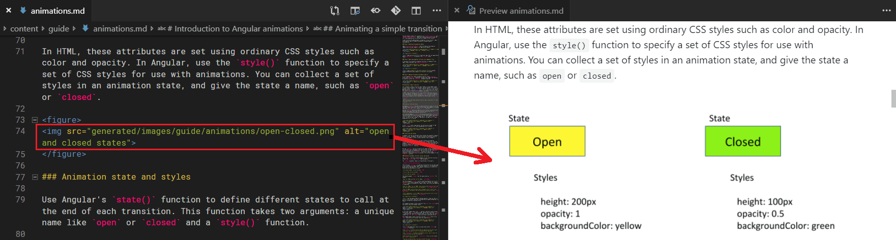
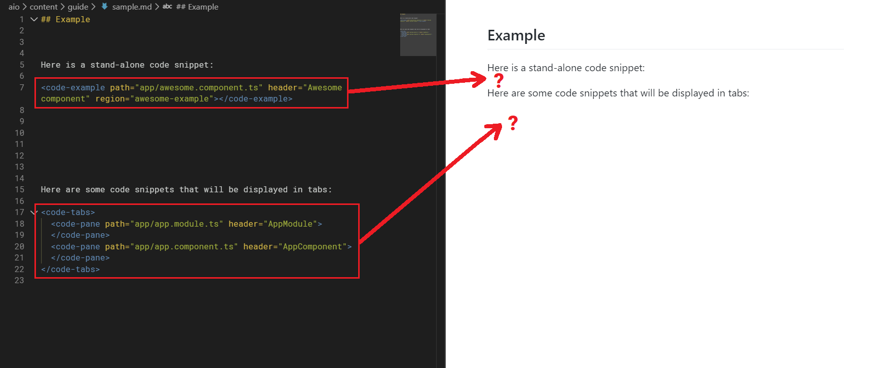
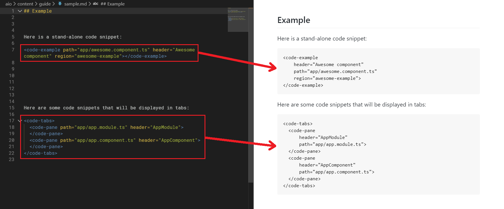

# Angular.io Documentation Utilities

A [VSCode](https://code.visualstudio.com/) extension providing a set of simple utilities to aid in authoring/viewing [Angular documentation](https://angular.io/) source code.

<sub align="center">

  > _The extension is only intended for people working with the source code of the [Angular documentation](https://angular.io/) content (e.g. authors, core contributors)._

</sub>
<br />

[)](https://travis-ci.org/gkalpak/aio-docs-utils/branches)
&emsp;
[)](https://ci.appveyor.com/project/gkalpak/aio-docs-utils/branch/master)
&emsp;
[](https://marketplace.visualstudio.com/items?itemName=gkalpak.aio-docs-utils)
&emsp;
[](https://github.com/gkalpak/aio-docs-utils/tree/master/LICENSE.txt)

## Features

### Code snippet utilities

The extension provides features that are useful for viewing and authoring code snippets (with source code extracted from standalone apps) in [Angular](https://github.com/angular/angular) API docs and guides.

#### Show code snippets on hover

Hovering over `<code-example>`, `<code-pane>` or `{@example}` tags shows the extracted code snippets, including their header and line numbering.

<sub>

_**Note**: Both `header` and `title` attributes are recognized for backwards compatibility._

</sub>


#### Peek/Go to code snippet definition

Right-clicking on `<code-example>`, `<code-pane>` or `{@example}` tags shows context menu options for peeking the definition (source code regions) and navigating to the definition (source code file) of the code snippet.


If the code snippet consists of multiple docregions, all regions are highlighted.


#### Autocomplete suggestions for docregions

When creating `<code-example>`, `<code-pane>` or `{@example}` tags, autocomplete suggestions are shown for the `region` attribute.


_**Note**: Autocomplete suggestions are triggered by the characters `=` (after `region`) and `'`/`"` (after `region=`)._

<p align="right">
  <sub><sub>
    <i>GIFs captured with <a href="https://www.screentogif.com/">ScreenToGif</a></i> &#x2740;
  </sub></sub>
</p>

### Markdown preview enhancement

The extension enhances the generated previews of documentation Markdown files (mainly guides in the `aio/content/` directory and its sub-directories).

#### Fix URLs to local images

Due to how the [angular.io](https://angular.io/) build system works, the local images referenced in guides will be served from a `generated/images/` directory in production. During development, images are located in the `aio/content/images/` directory (from where they are copied to `aio/src/generated/images/` and from there to `aio/dist/generated/`).

The extension fixes the URLs of such images in Markdown previews, so that they point to the correct image files on disk and thus correctly show up in the preview.

_Before the fix:_


_After the fix:_


#### Fix code snippets display

Code snippets are included in guides as `<code-example>` elements or `<code-tabs>` with one or more `<code-pane>` elements (for tabbed code snippets). In guide previews, these unknown HTML elements are not shown at all, making the preview a bit misleading.

The extension transforms these elements in Markdown previews, so that they are shown as code blocks (with appropriate formatting to improve readability).

_Before the fix:_


_After the fix:_


## Releases

See [here](https://github.com/gkalpak/aio-docs-utils/releases) for a list of releases.<br />
See [here](https://github.com/gkalpak/aio-docs-utils/commits) a list of changes.

You can find the latest published version [here](https://marketplace.visualstudio.com/items?itemName=gkalpak.aio-docs-utils).

## Known issues

### Possible inconsistency with the actual implementation

The examples in the actual docs are processed via [dgeni](https://github.com/angular/dgeni) and more specifically using utilities in the [examples-package](https://github.com/angular/angular/tree/master/aio/tools/transforms/examples-package).<br />
This extension re-implements the relevant logic, but might have slight inconsistencies compared to the actual `dgeni` implementation.

### Multi-line `{@example ...}` tags not fully supported

`{@example ...}` tags spreading across multi lines will not be recognized if there are lines that contain only unnamed attributes (such as the path or header). For example:

_These **will not** be recognized:_
```
{@example
  path/to/examp.le
  region="foo"
}

{@example path/to/examp.le region="foo"
  This is the header
}
```

_These **will** be recognized:_
```
{@example
  path/to/examp.le region="foo"
}

{@example path/to/examp.le region="foo"
  header="This is the header"
}

{@example path/to/examp.le
  region="foo" This is the header
}
```

---
## TODO

Things I want to (but won't necessarily) do:

- Consider using `webpack` for start-up time (and overall perf?) improvement.
  (References: https://medium.com/@fabiospampinato/why-i-wrote-33-vscode-extensions-and-how-i-manage-them-cb61df05e154, https://code.visualstudio.com/updates/v1_29#_bundling-extensions)
- Investigate switching from Travis+AppVeyor to CircleCI for testing on all platforms.
- Release (minor?).

- Add e2e tests.
- Investigate possible `fixGuideCodeSnippetsPlugin()` improvements:
  - Improvement 1: Parse and show snippet info (header, path, region, etc.).
    - Investigate parsing snippets (without file info).
      - Make `CodeSnippetUtils#getInfo()` (`getInfoHtml()`?) more easily reusable.
    - Replace current `<pre></pre>` code block with a more structured representation of the parsed info.
  - Improvement 2: Show snippet content (requires containing document?).
    - Investigate getting doc from active editor or open editor (matched by code snippet opening tag) and parsing snippets fully (with content). E.g.:
      - Modify `CodeSnippetUtils` to be able to extract info directly from content (instead of `TextDocument` + `Position`).
      - Use `window.activeTextEditor.document.fileName` to resolve the example path.
        _Ideally, this would need to be matched against the correct provider so that the example path could be resolved correctly (and also skip work for non-matching Markdown files)._
        _For extra confirmation, I could use the opening tag string and search for it in the active document._
          _(Do I need to deal with formatting (e.g. whitespace)?)_
      - Extract the code snippet attributes and content and show them in the Markdown preview.
        _This is very similar to `CodeSnippetIntellisenseProvider#provideHover()`. Investigate reuse opportunities._
- Investigate/Add ability to preview app in `WebView > iframe`. E.g.:
  ```ts
  const panel = window.createWebviewPanel('foo', 'Hello, world!', ViewColumn.Active, {
    enableScripts: true,
    retainContextWhenHidden: true,
  });
  panel.webview.html = `
    <!DOCTYPE html>
    <html>

      <head>
        <style>
          html, body {
            margin: 0;
            overflow: hidden;
            padding: 0;
          }

          iframe {
            border: none;
            height: 100vh;
            width: 100vw;
          }
        </style>
      </head>

      <body>
        <iframe src="http://localhost:4200/"></iframe>
      </body>

    </html>
  `;
  ```
  (References: https://code.visualstudio.com/api/extension-guides/webview)
- Refactor `CodeSnippetUtils` into separate (independently unit-testable) "parsers" for different types of tags (`HtmlTag`, `NgdocTag`, etc.), that would return `ICodeSnippetRawInfo` and `ICodeSnippetAttrInfo`.
